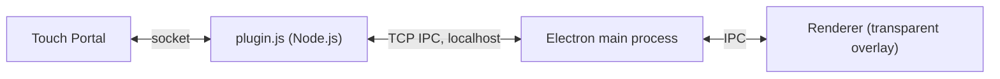

# Screen Graphics - Touch Portal Plugin

A Touch Portal plugin that spawns transparent on-screen overlay effects for streamers. Viewers can trigger visual effects (flashbangs, screen shake, glitches, and more) that appear over the streamer's game without blocking input.

> 📖 **New here?** See the [How-To Guide](docs/HOW-TO.md) for setup, custom effects, building, and troubleshooting.

## Features

- 10 built-in screen effects
- Shows up in OBS (Display Capture) so viewers see the chaos
- Optional live screen streaming for motion-tracking effects
- Effect queue system with delay support
- Multi-monitor support - choose which display the effect appears on
- Fully transparent, click-through overlay - the streamer can still play
- Extensible - create your own effects with a simple JS file
- Works with any game running in borderless windowed mode

## Installation

1. Download the latest `.tpp` file from Releases
2. Open Touch Portal and go to **Settings > Plug-ins > Import**
3. Select the `.tpp` file
4. Restart Touch Portal when prompted

### Development Setup

```bash
git clone git@github.com:spdermn02/TouchPortal-Screen-Graphics-Plugin.git
cd TouchPortal-Screen-Graphics-Plugin
npm install
```

## Built-in Effects

| Effect | Duration | Description |
|---|---|---|
| **Flashbang** | 5s | Blinding white flash with blur, rotation wobble, and radial recovery from center outward |
| **Double Vision** | 7s | Three drifting image layers with chromatic aberration and swaying motion |
| **Screen Shake** | 4s | Intense earthquake tremor with impact flash that decays over time |
| **Static Glitch** | 5s | TV static with scanlines, RGB channel splitting, and random frame tearing |
| **Tunnel Vision** | 6s | Black closes in from edges to a small pulsing circle with heartbeat red tint |
| **Color Invert** | 4s | Strobing negative color inversion with hue rotation |
| **Drunk Cam** | 8s | Heavy multi-frequency swaying, zoom breathing, queasy tint, and dark vignette |
| **UFO Abduction** | 8s | A flying saucer descends, projects a tractor beam, and abducts taskbar icons (and a cow) |
| **Dial-Up Load** | 30s | 90s dial-up style progressive image load that reveals the screen block by block |
| **Mirror Flip** | 10s | Rotates the screen like a 3D cube to reveal a fully mirrored live display |

All effects are semi-transparent (60-75% opacity) so the streamer can still see their game underneath.

## Touch Portal Actions

### Queue Effect

Triggers an effect immediately (or after the current one finishes if one is playing).

| Parameter | Type | Description |
|---|---|---|
| Effect | Choice | Which effect to play |
| Target Display | Choice | Which monitor to show the effect on |

### Queue Effect (Delayed)

Queues an effect to play after a specified delay.

| Parameter | Type | Description |
|---|---|---|
| Effect | Choice | Which effect to play |
| Target Display | Choice | Which monitor to show the effect on |
| Delay (seconds) | Number | How long to wait before playing |

### Stop Current Effect

Immediately stops the currently playing effect. If there are queued effects, the next one will play.

### Stop All Effects

Stops the current effect AND clears the entire queue.

### Clear Effect Queue

Clears all queued effects but lets the currently playing effect finish naturally.

## Touch Portal States

These states update in real-time and can be used in Touch Portal buttons and conditionals.

| State | Description | Example Values |
|---|---|---|
| **SG: Current Effect** | Name of the currently playing effect | "Flashbang", "None" |
| **SG: Queue Length** | Number of effects waiting in the queue | "0", "3" |
| **SG: Plugin Status** | Current plugin state | "initializing", "connected", "starting", "ready" |
| **SG: Display Count** | Number of detected monitors | "1", "2" |

## Testing Effects Without Touch Portal

You can preview any effect without Touch Portal running:

```bash
# Default: Flashbang with 2 second delay
node test-effect.js

# Specific effect with custom delay
node test-effect.js "Screen Shake" 1000
node test-effect.js "UFO Abduction" 500

# Live mode: overlay hidden from capture, live effects stream the screen
node test-effect.js Flashbang 500 --hide-from-capture
```

**Controls while running:**
- **Enter** - Replay the effect
- **s** - Stop the current effect
- **q** - Quit

## Plugin Settings

| Setting | Default | Description |
|---|---|---|
| **Hide overlay from screen capture** | Off | When on, the overlay is invisible to OBS and other screen capture, and Flashbang, Drunk Cam, and Mirror Flip distort your screen live. When off, viewers can see effects and those three use a snapshot instead. See the [How-To Guide](docs/HOW-TO.md#show-effects-on-stream-obs). |

## Streaming with OBS

Add a **Display Capture** of the monitor the effects play on. **Game Capture** only hooks the game's window, so it never shows effects. If you use it, put a Display Capture of the same monitor above it.

## Multi-Monitor Support

The plugin automatically detects all connected displays when it starts. Each display appears as a choice in the Touch Portal action dropdown (e.g., "Display 1 - 2560x1440 (Primary)"). Select "Primary" to always target the main monitor.

## Known Limitations

- **Exclusive fullscreen games**: The overlay cannot appear above games running in exclusive fullscreen mode (Vulkan/DX12). The game must be in **borderless windowed** mode.
- **Requires Touch Portal 4.3+** (plugin API 10).
- **Screenshot timing**: Effects distort a screenshot captured at trigger time, so they won't track a fast-moving scene. Flashbang, Drunk Cam, and Mirror Flip can use a live screen stream, but only with **Hide overlay from screen capture** on, which also hides them from OBS.
- **Windows only (packaged)**: Only the Windows build bundles Node.js and Electron. Mac/Linux builds are untested.
- **GPU errors**: Some systems may occasionally log GPU-related errors in the console. These are typically harmless Electron/Chromium messages and don't affect the effect playback.

## Building the Plugin Package

```bash
npm run build        # current OS
npm run build:win    # → screen-graphics-win.tpp
```

This creates `screen-graphics-<os>.tpp` in the project root, which can be imported into Touch Portal. The downloaded `node.exe` is cached in `.build-cache/` between builds. Official releases are built by GitHub Actions when a `v*` tag is pushed. See the [How-To Guide](docs/HOW-TO.md#5-build-and-release) for details and release steps.

## Architecture



Touch Portal launches `plugin.js`, which connects via the `touchportal-api` package. Once connected, the plugin spawns a single long-lived Electron process that creates a transparent, click-through, always-on-top window covering the target display. Effects run as animations in the Electron renderer.

## License

MIT
