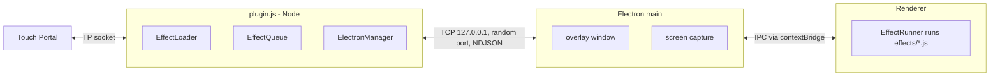

# Screen Graphics — How-To Guide

This guide covers installing and using the plugin, how it works under the hood, building your own
effects, and packaging a release. For the full effect API reference, see
[`effects/README.md`](../effects/README.md).

- [1. Install and Use](#1-install-and-use)
- [2. How It Works](#2-how-it-works)
- [3. Developer Setup](#3-developer-setup)
- [4. Create a Custom Effect](#4-create-a-custom-effect)
- [5. Build and Release](#5-build-and-release)
- [6. IPC Protocol Reference](#6-ipc-protocol-reference)
- [7. Troubleshooting](#7-troubleshooting)
- [8. Known Limitations](#8-known-limitations)

---

## 1. Install and Use

### Install

1. Download `screen-graphics-win.tpp` from the
   [Releases](https://github.com/spdermn02/TouchPortal-Screen-Graphics-Plugin/releases) page.
2. In Touch Portal, open **Settings → Plug-ins → Import plug-in** and pick the `.tpp`.
3. Trust the plugin when prompted, then restart Touch Portal.
   Requires **Touch Portal 4.3 or newer**.
4. The **SG: Plugin Status** state should read `ready` once the overlay is up.

The Windows package is self-contained: it ships its own `node.exe` and Electron runtime, so you
don't need Node.js installed.

### Set up your game

Put your game in **borderless windowed** mode. The overlay is a transparent, always-on-top window;
it cannot draw over exclusive-fullscreen (DX12/Vulkan) games.

### Make a button

1. Create a new button in Touch Portal.
2. Add the action **Screen Graphics → Queue Effect**.
3. Pick an **Effect** and a **Target Display** (`Primary` follows whatever Windows calls primary).
4. Press it. The effect plays over your screen; mouse and keyboard input pass straight through.

### Actions at a glance

| Action | What it does |
|---|---|
| Queue Effect | Plays now, or after whatever's currently playing |
| Queue Effect (Delayed) | Adds the effect to the queue after N seconds |
| Stop Current Effect | Kills the playing effect; the next queued effect starts |
| Stop All Effects | Kills the playing effect, clears the queue, cancels pending delays |
| Clear Effect Queue | Clears the queue and pending delays; the current effect finishes |

Effects never overlap. Everything goes through a single FIFO queue.

### Use the states

| State | Use it for |
|---|---|
| `SG: Current Effect` | Show what's playing on a button, or block a button while something runs |
| `SG: Queue Length` | Show a backlog counter; disable redemptions when the queue is long |
| `SG: Plugin Status` | `initializing` → `connected` → `starting` → `ready` |
| `SG: Display Count` | Sanity check that all monitors were detected |

Example: to rate-limit viewer triggers, add a condition to your button so it only fires
**Queue Effect** when `SG: Queue Length` is below `3`.

### Show effects on stream (OBS)

The overlay is visible to screen capture by default, so viewers see the effects.

- **Use Display Capture** of the monitor the effects play on.
- **Game Capture won't show effects.** It only hooks the game's own window. If you capture the
  game that way, add a Display Capture of the same monitor above it.
- **Avoid Window Capture of `electron.exe`.** The overlay hides between effects and may lose
  its transparency.

#### Plugin setting: Hide overlay from screen capture

In **Settings → Plug-ins → Screen Graphics**. It's **Off** by default.

| Setting | Viewers see effects | Flashbang / Drunk Cam / Mirror Flip |
|---|---|---|
| **Off** (default) | ✅ | Distort a snapshot taken when the effect triggers |
| **On** | ❌ (only you see them) | Distort your screen live, in motion |

The trade-off exists because the live effects record your screen while they play. If the
overlay were visible to capture, they'd record themselves in an endless hall of mirrors.
Windows can only hide a window from *all* capture, OBS included, or none. Changes apply from
the next effect, with no restart needed. Switching it off during a live effect keeps the overlay
hidden until that effect ends.

### Viewer-triggered effects

The plugin doesn't talk to Twitch/YouTube itself. Wire whatever Touch Portal event source you
already use (a streaming-platform plugin, a webhook plugin, etc.) to a button or event that runs
**Queue Effect**.

---

## 2. How It Works



1. **Startup.** Touch Portal launches `plugin.js` using the command in `entry.tp`. On connect,
   `EffectLoader` scans `effects/` and `user-effects/`, and the effect names get pushed to the
   action dropdowns with `choiceUpdate`.
2. **Electron spawn.** `ElectronManager` opens a TCP server on a random localhost port and
   spawns Electron with `--ipc-port=<port>`. It uses the bundled `electron-dist/` if present,
   otherwise the `electron` npm package.
3. **Overlay.** `electron/main.js` creates one hidden, frameless, transparent, click-through,
   `screen-saver`-level always-on-top window. It sends `DISPLAYS_LIST` and `READY` back. The
   plugin then fills the **Target Display** dropdowns.
4. **Trigger.** A button press → `EffectQueue.enqueue()` → `PLAY_EFFECT` over TCP.
5. **Play.** Electron moves the window onto the target display, grabs a screenshot, shows the
   window, and hands it to the renderer. It also passes a `desktopCapturer` source ID for live
   effects, but only when the overlay is hidden from capture (see below).
6. **Run.** `EffectRunner` injects the effect file as a `<script>`, picks up
   `window.__effectExport`, optionally starts a live screen stream (`useLiveStream: true`), and
   awaits `execute()`. It races that against the abort signal and a `duration + 5s` safety timeout.
7. **Finish.** The renderer reports `effect-finished` (or `effect-error`), the window hides, and
   the queue advances to the next effect.

**Capture visibility.** The **Hide overlay from screen capture** setting travels from Touch
Portal to `plugin.js` (the `Settings` event) and then to Electron (`SET_CAPTURE_PROTECTION`).
Electron applies it with `setContentProtection()`. It's off by default so OBS can record the
overlay. When it's off, no live source ID is handed out, because a capturable overlay would
record itself; the live effects fall back to the screenshot. When it's on, the window is hidden
from all capture and live streams are allowed.

### Source map

| File | Role |
|---|---|
| `entry.tp` | Touch Portal manifest: actions, states, start commands |
| `plugin.js` | Wires TP actions ↔ queue ↔ Electron; resolves display labels to IDs |
| `src/constants.js` | Action, data, state, and IPC identifiers |
| `src/tp-client.js` | `touchportal-api` client setup; ignores button-hold events |
| `src/effect-loader.js` | Discovers effects and reads their metadata with `require()` |
| `src/effect-queue.js` | FIFO queue, delay timers, state events |
| `src/electron-manager.js` | TCP server, Electron process lifecycle, message buffering until `READY` |
| `electron/main.js` | Overlay window, display handling, screen capture |
| `electron/preload.js` | `window.screenGraphics` bridge (context-isolated) |
| `electron/renderer/effect-runner.js` | Loads, runs, times out, and cleans up effects; live stream |
| `effects/*.js` | Built-in effects |
| `user-effects/` | Drop-in folder for custom effects |
| `test-effect.js` | Standalone harness, no Touch Portal needed |
| `scripts/build.js` | Builds the `.tpp` package |
| `.github/workflows/release.yml` | CI: builds on PRs, publishes releases on `v*` tags |

---

## 3. Developer Setup

**Prerequisites:** Node.js 24+ (LTS), npm, git. You need Windows for real end-to-end testing because
that's the only fully packaged target (see [Known Limitations](#8-known-limitations)).

```bash
git clone git@github.com:spdermn02/TouchPortal-Screen-Graphics-Plugin.git
cd TouchPortal-Screen-Graphics-Plugin
npm install
```

### Fast loop: preview effects without Touch Portal

```bash
node test-effect.js                    # Flashbang after 2s
node test-effect.js "Mirror Flip" 1000 # any effect name, custom delay (ms)
node test-effect.js Flashbang 500 --hide-from-capture  # live mode, hidden from OBS
```

In the terminal: **Enter** replays, **s** stops mid-effect, **q** quits. The harness prints the
detected displays and each effect's start, finish, and error events. It always targets the
primary display.

### Full loop: inside Touch Portal

Touch Portal launches the plugin itself, so the reliable path is to build, import, and test:

```bash
npm run build:win
# import screen-graphics-win.tpp in Touch Portal, restart TP
```

Can't build locally? Every PR's workflow run attaches the built `.tpp` under **Artifacts**.

Plugin logs go to Touch Portal's log output. `[electron]`-prefixed lines come from the overlay
process.

---

## 4. Create a Custom Effect

### Step 1: Scaffold

Create `user-effects/my-effect.js` in the repo (or in the installed plugin folder, see Step 4).
Any `.js` file in `effects/` or `user-effects/` gets loaded. It needs `name` and `duration`,
otherwise it's skipped.

```javascript
const myEffect = {
  name: 'My Effect',            // shown in the TP dropdown; must be unique
  description: 'What it does',
  duration: 3000,               // ms; also sets the safety timeout (duration + 5s)
  // useLiveStream: true,       // opt in to a live <video> of the screen (see below)

  execute: async (container, options) => {
    const { screenshotDataUrl, liveVideo, signal, duration = 3000 } = options;

    return new Promise((resolve) => {
      if (signal?.aborted) return resolve();

      const layer = document.createElement('div');
      layer.style.cssText = `
        position:absolute; inset:0;
        background:url(${screenshotDataUrl}) center/cover;
        opacity:0.7;
      `;
      container.appendChild(layer);

      const start = performance.now();
      function frame(now) {
        if (signal?.aborted) return resolve();
        const p = Math.min((now - start) / duration, 1);
        layer.style.filter = `hue-rotate(${p * 360}deg)`;
        layer.style.opacity = String(0.7 * (1 - p));
        p < 1 ? requestAnimationFrame(frame) : resolve();
      }
      requestAnimationFrame(frame);
      signal?.addEventListener('abort', () => resolve(), { once: true });
    });
  },

  cleanup: (container) => {
    container.innerHTML = '';
  },
};

// Both exports are required: Node reads metadata, the renderer runs the effect.
if (typeof module !== 'undefined' && module.exports) module.exports = myEffect;
if (typeof window !== 'undefined') window.__effectExport = myEffect;
```

### Step 2: Choose your input source

| Source | How | When |
|---|---|---|
| Nothing | Ignore both | Pure overlays (masks, tints, sprites), e.g. Tunnel Vision |
| Frozen screenshot | `options.screenshotDataUrl` as a CSS background or `` | Cheap distortions of what was on screen |
| Live screen | Set `useLiveStream: true`, then `ctx.drawImage(options.liveVideo, …)` each frame | Distortions that should track the game in motion (Flashbang, Drunk Cam, Mirror Flip) |

Live streams only run when **Hide overlay from screen capture** is on. That's off by default, so
`liveVideo` is usually `null` and **your effect must work from the screenshot too**. With live
streams, check `liveVideo && liveVideo.readyState >= 2` before drawing, and fall back
to the screenshot if it's `null`. Starting the stream can fail, and it has a 2s startup timeout.

### Step 3: Test it

```bash
node test-effect.js "My Effect" 500
```

Before you ship, check:

- [ ] The promise always resolves (natural end **and** abort)
- [ ] **s** stops it cleanly, with nothing left on screen
- [ ] `cleanup` removes every element, timer, and injected `<style>`
- [ ] Main layers stay around 60–75% opacity, so the streamer can still see the game
- [ ] Rotated or scaled layers are oversized (e.g. `inset:-10%`) so corners don't show
- [ ] It holds 60fps. Animate `transform`, `opacity`, and `filter`, not layout properties

### Step 4: Install it for real

Copy the file into the installed plugin's `user-effects/` folder. On Windows that's normally
`%APPDATA%\TouchPortal\plugins\screen-graphics\user-effects\`. Then restart Touch Portal (or the
plugin). The new effect shows up in the dropdowns automatically; you don't need to edit
`entry.tp`.

> Back up your custom effects before re-importing a new `.tpp`. Re-importing can replace the
> plugin folder.

To make it a **built-in** effect instead, put it in `effects/` and add its name to both
`valueChoices` arrays in `entry.tp`. That list is only the pre-connect default; the live list
comes from `choiceUpdate`.

> ⚠️ **Security:** Effect files are loaded with Node's `require()` in the plugin process, and with
> Node, top-level code runs with full access to your user account. Only install effects from
> people you trust, and read them first.

---

## 5. Build and Release

```bash
npm run build:win     # → screen-graphics-win.tpp
```

What the build does (`scripts/build.js`):

0. Checks that `node_modules/electron/dist` has the target OS's Electron binary. npm only
   installs the binary for the OS it ran on, so you can't cross-build a mac package from Windows.
1. Stages `entry.tp`, `plugin.js`, `package.json`, `src/`, `electron/`, `effects/`, and
   `user-effects/` into `.build-temp/screen-graphics/`.
2. Copies `touchportal-api` and its transitive production dependencies. The `electron` npm
   package is excluded.
3. Copies `node_modules/electron/dist` → `electron-dist/`.
4. (Windows only) Downloads `node.exe` v24.21.0 (LTS) once and caches it in `.build-cache/`
   (gitignored). Later builds reuse it. Delete the folder to force a fresh download.
   Every copy, cached or fresh, is checked against the release's official `SHASUMS256.txt`. A
   bad cached copy is downloaded again; a bad download fails the build. The checksum is always
   fetched fresh, so **builds need internet access** even with a warm cache.
5. Zips everything under a `screen-graphics/` root into the `.tpp`, then deletes the temp dir.

The output is about 150 MB, almost all of it Electron and Node. `*.tpp` is gitignored, so never
commit it.

### Cutting a release

Releases are built and published by GitHub Actions
(`.github/workflows/release.yml`). Don't upload `.tpp` files by hand.

1. Bump `version` in `package.json` **and** `version` in `entry.tp` (integer, e.g. `100` →
   `101`). Touch Portal uses the `entry.tp` version.
2. Open a PR. The workflow builds the Windows package; download it from the run's
   **Artifacts** section, import it into Touch Portal, fire each effect, and try Stop and
   Stop All.
3. Merge, then tag `main`:

   ```bash
   git checkout main && git pull
   git tag v1.0.1 && git push origin v1.0.1
   ```

The tag push builds the package, generates `SHA256SUMS.txt`, and publishes a release with
auto-generated notes. Edit the notes on GitHub afterwards if you want more detail.

| Trigger | Builds | Publishes |
|---|---|---|
| PR to `main` | ✅ (artifact, kept 14 days) | — |
| Manual (**Actions → Build & Release → Run workflow**) | ✅ (artifact) | — |
| Tag `v*` | ✅ | ✅ Release with `.tpp` + checksums |

- **The tag must match `package.json`.** `v1.0.1` requires `"version": "1.0.1"`, otherwise the
  build fails before anything is published.
- **Pre-releases:** a tag with a suffix (`v1.1.0-beta.1`) is published as a pre-release.
- **A failed release** leaves no release behind. Fix the problem, delete the tag
  (`git push origin :v1.0.1 && git tag -d v1.0.1`), and tag again.

---

## 6. IPC Protocol Reference

Plugin ↔ Electron uses newline-delimited JSON over TCP on `127.0.0.1`. Each message is
`{ "type": ..., "payload": ... }`.

**Plugin → Electron**

| Type | Payload | Effect |
|---|---|---|
| `PLAY_EFFECT` | `{ name, filePath, displayId, options }` | Position, capture, show, run |
| `STOP_EFFECT` | — | Abort the current effect |
| `STOP_ALL` | — | Same as stop (the plugin clears the queue) |
| `SHOW_OVERLAY` / `HIDE_OVERLAY` | — | Manual window visibility |
| `GET_DISPLAYS` | — | Re-send `DISPLAYS_LIST` |
| `SET_CAPTURE_PROTECTION` | `{ enabled }` | Hide or show the overlay to screen capture; also allows or blocks live streams |

**Electron → Plugin**

| Type | Payload | Meaning |
|---|---|---|
| `READY` | — | Overlay up; buffered messages get flushed |
| `DISPLAYS_LIST` | `[{ id, width, height, x, y, primary }]` | Primary first; also sent on display add/remove |
| `EFFECT_STARTED` | `{ name }` | Renderer began executing |
| `EFFECT_FINISHED` | `{ name }` | Done or aborted; the queue advances |
| `EFFECT_ERROR` | `{ name, error }` | Failed or timed out; the queue still advances |

Messages sent before `READY` get queued in `ElectronManager` and flushed on `READY`. Anything
sent from a `READY` listener (the capture setting) goes out ahead of that queue.

---

## 7. Troubleshooting

| Symptom | Likely cause / fix |
|---|---|
| Status stuck at `starting` | Electron failed to launch. Check the TP logs for `[electron]` errors and confirm `electron-dist/electron.exe` exists in the plugin folder |
| Effect doesn't show over the game | Game is in exclusive fullscreen. Switch to borderless windowed |
| Effect shows on the wrong monitor | Display list is stale. Restart the plugin; `Display N` labels come from detection order at startup |
| New custom effect not in the dropdown | Missing `name`/`duration`, a syntax error (look for `Failed to load effect` in the logs), or the plugin wasn't restarted |
| Queue stalls for a few seconds | An effect never resolved; the `duration + 5s` timeout rescued it. Fix the effect's resolve paths |
| Effects don't show up in OBS | Turn **Hide overlay from screen capture** off, then use Display Capture (not Game Capture) of that monitor. See [Show effects on stream](#show-effects-on-stream-obs) |
| Live effect looks frozen | Expected when **Hide overlay from screen capture** is off, since live effects then use a snapshot. If it's on, the live stream failed to start; check for `Failed to start live stream` |
| Build fails with `node.exe checksum mismatch` | The download was corrupted or tampered with. Retry; if it keeps failing, check your network or proxy before anything else. Don't bypass the check |
| Two effects share a `name` | The later-loaded one wins, and `user-effects/` loads after `effects/`. Rename one |

---

## 8. Known Limitations

- **Windows is the only verified target.** `build:mac` and `build:linux` must run on that OS.
  They don't bundle Node, so `entry.tp` relies on a system `node` being on Touch Portal's PATH.
  The plugin resolves the macOS binary at `electron-dist/Electron.app/Contents/MacOS/Electron`,
  and the build preserves the `.app` bundle's symlinks. Whether Touch Portal's `.tpp` importer
  keeps symlinks and the executable bit hasn't been tested, so treat mac/linux as experimental.
- **Exclusive fullscreen games aren't supported** (OS/compositor limitation).
- **Screenshot effects use a frozen frame.** Only effects with `useLiveStream: true` track
  motion, and only while the overlay is hidden from capture. You can have live motion or
  on-stream effects, not both.
- **One effect at a time.** By design, there's no layering or concurrent playback.
- **Display labels are positional** (`Display 1`, `Display 2`, …). Changing your monitor
  arrangement can reshuffle them.
- **Harmless GPU log noise** from Chromium may appear; hardware acceleration is disabled for
  reliable transparency.
